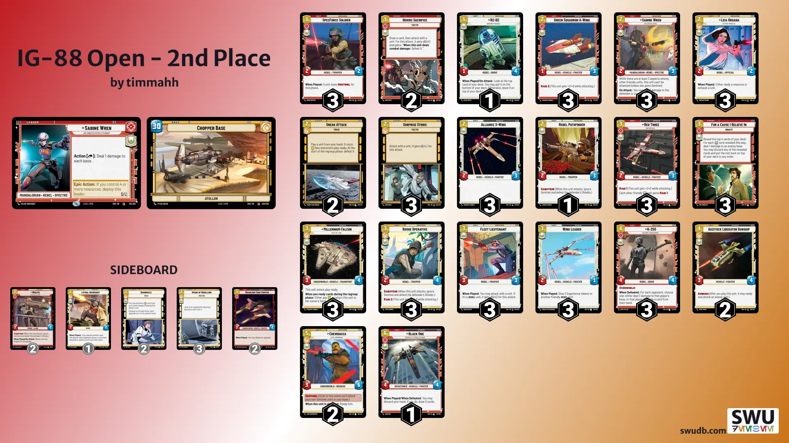
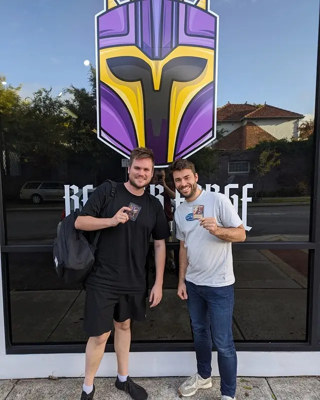

The day started out unlike most others, I don't normally eat breakfast, but we made our way out to The Shorehouse to celebrate my sisters birthday. The coffee was below par and when you're charging $24 for a Belgian Waffle with fruit on top, you better hope there are 2 waffles on that plate. To my dismay, the waiter presented me with a plate with just a single waffle on it and a mountain of fruit. But I couldn't dwell on that for too long, I said goodbye to my family and set out to win a sweet IG-88 showcase.

The decklist I brought into the day was as follows:

Since I had gone 0-3 at the last 2 Beskar Forge events that I attended; confidence levels were not high and given it was double elimination, I was prepared for an early day. Having said that, I had been smashing games on Karabast all week and felt like if I could dodge the Boba Fett matchup, I might be able to make it a few rounds.

I must also give props to the guys at Beskar Forge for experimenting with different formats. In the lead up to the IG-88 Open, you could collect Bounties weekly for things such as having a winning record with a deck containing only commons and uncommons or bringing a friend. Those bounties were used to seed players into the bracket for the Open and given I hadn’t claimed any bounties, I was in for a tough day.

## Round 1 - 0-2 vs Ash on Boba Cunning

Round 1 was exactly what I didn’t want to see, as nice as Ash is, he was playing Boba Cunning.

Having lost the initiative roll, he was able to Waylay my turn 1 play of a Green Squadron A-Wing and proceeded to keep my units off the board. By the time my Sabine leader came down, he was able to No Good to me Dead her and prevent me from pushing damage to his base. On his Boba flip turn, he was able to use Cunning to hit my base for 8 and there wasn’t much for me to do aside look towards game 2.

In between games, I sideboarded in 3 Spark of Rebellion in the hope that I could pick off a Cunning.

I started out in game 2 strongly with a combination of Green Squadron A-Wing turn 1 into Fleet Lieutenant turn 2 to hit base for 5. He was able to land some units on the board but I was feeling good going into my Sabine flip on turn 3. I started out playing Spark, picking off a Cunning from his hand and pushing more damage to base. I was then able to play K-2SO on turn 4 with the hope that I could race him to 30 damage on base.

He managed to remove K-2 with ease and I automatically dealt 3 damage to base using K-2s “When Defeated” trigger which was a turning point in the match. Ash only had one card in hand, which I should have made him discard as it was a Fett’s Firespray. The following turn, the Firespray hit the board and turned the tide of battle in his favour.

Down to the losers bracket I went and my thoughts of an early day were starting to come to fruition.

## Round 3 - 2-0 vs Paul on Han Security Complex

After losing in round 1, I had a bye to wait for more losers to join us in the losers bracket. Enter one of the Forge Masters in Paul running Han Security Complex, a deck I knew very little about. Seeing a 25 HP base across the table made it clear it was time for second breakfast as the half serving of waffles had left me a bit hungry.

I was able to establish board presence early in game 1 with Leia Organa into SpecForce Soldier which I then followed up with a Red Three to make everything hit a bit harder. By then I was off to the races with very little to slow me down and it was on to game 2.

Game 2 started out much the same, I was able to lane dodge by going into space on turn 1 with A-Wing followed by a turn 2 Millennium Falcon. He got a few shots in with Ezra and C-3PO, drawing a Falcon of his own but by the time I was able to Wing Leader my Sabine leader, the Security Complex had been breached and I was playing on.

## Round 4 - 2-0 vs Matt Sabine ECL

I felt good going into round 4 because I had plenty of practice online against Sabine ECL and knew that I had to go into it with a control mindset knowing my top end was better than his. Another 25 HP base meant it was time for elevenses.

Game 1 I was able to neutralise a lot of his threats on the ground while establishing a space presence to the point where I felt comfortable being able to flip the switch and base race. The second game was a much tighter affair (life is short).

He played Sabine unit turn 1, then give it 2 experience with Wing Leader and some additional Academy Training for a 6/7 unit that deals 7 on attack. I again defaulted to space and managed to get a crucial Leia to exhaust his juggernaut Sabine before he ECL’d in Zeb to kill my Sabine leader.

With the game still tight, I managed to get him to 17 damage on base before I used Sneak Attack to bring in K-2SO and Heroic Sacrifice him for the remaining 8 damage; the dream run was alive.

## Round 5 - 2-1 vs Joe Sabine Cunning

The game was won on the initial dice roll, that is all.

But in all seriousness, it was a tough series, this time into the exact mirror deck so it all came down to making good decisions.

Game 1 started with a solid A-Wing into Fleet Lieutenant against his Leia and from there it was just a case of pushing as much damage to base as quickly as possible. 1-0 to me.

In between games, I brought in 1 Lothal Insurgent for the Black One as an additional turn 1 play and to threaten his hand later on.

I made a massive mistake in resourcing for game 2; I was deciding between keeping Leia who didn’t offer much in the previous match and an Alliance X-Wing which meant I was committed to space for the early portion of the game. I ultimately decided to keep the X-Wing only for Joe to play an A-Wing turn 1 and put me behind. As much as I tried to control the game, the early damage was done and we were 1-1.

I felt good going into game 3 knowing I had the initiative and my initial hand dictated we were going space heavy with an A-Wing into Millennium Falcon. Joe went to the ground arena and we were trading damage back and forth well into our Sabine flip turns. I was able to get mine in first followed by Wing Leader to give Sabine 2 experience but Joe had 4 units on the ground that had me worried.

Enter the turn 4 Chewbacca, who would put a halt to Joe’s momentum on the ground and allow me to freely push more damage in space. One thing I learnt from all the games on Karabast is to just pass turns when Chewie is on the board so that you can take advantage of him when he gets attacked and in doing so I was able to prevent 6 damage done to my base in order to do 3 to his.

The 9 damage swing was enough to turn the match in my favour and my day continued.

## Round 6 - 2-0 vs Andrew on Vader Command

Going into round 6 I had a bit of a chip on my shoulder from all the times Andrew’s son Oscar was able to deliver crushing defeats to me, I had to get one back. I was reasonably confident going into the game knowing that if I was able to push 25+ damage before Vader was able to influence the board, I should be able to close out the game most of the time.

In game 1, I felt like Andrew wasn’t getting the best of draws and I was able to establish board presence and push a lot of damage early. A turn 4 Resupply by Andrew was enough to buy me time with units on the board so I could play For a Cause I Believe In to finish the game off.

In between games I knew that if I needed to play Chewbacca, the game was probably lost so I removed him in favour of 2 Spark of Rebellion to remove a possible Overwhelming Barrage from hand.

I don’t actually remember much from game 2 but if game 1 was “too fast”, this one was “too furious” and I was onto the semi final.

## Round 7 vs Kevin Chirrut Tarkintown

The memes of an early day were dead and the dream run was very much alive. My thoughts going in were, turn cards, hit base, repeat and that we did.

Game 1 started with Kevin playing a Restored ARC-130 so I was nice enough to ping him 1 damage with Sabine and a Sabine unit of my own so he had something to restore. He followed up with a Yoda which I didn’t particularly care for, I had bases to hit. I was able to get some solid damage in with a Falcon, Red Three and Sabine leader that by the time Chirrut was made a “real boy” I was able to finish the game off.

In between games, I boarded in some upgrade hate in the form of Bamboozle and Disabling Fang Fighter along with Wolffe to slow down the life gain. The 3 SpecForce, 2 Chewie and Black One came out as the game would be over by the time they hit the board.

The second game was much slower because Yoda found a Jedi Lightsaber and it felt a lot like 2 steps forward, one step back with all the life he was able to restore. Kevin was able neutralise a lot of my threats while building a solid board with Obi-Wan Kenobi giving 2 more experience to Yoda, threatening a game 3.

The turning point came when I was able to Bamboozle Yoda, taking away all his upgrades and exhausting him before Surprise Strike-ing with Millennium Falcon followed up with For a Cause I Believe In.

The cause I believed in was the dream run.

## Final vs Luke Boba ECL

The one match up I had dreaded coming into the day was there, like the final boss, Boba Fett.

Knowing that Luke had sat most of the day waiting for his finals opponent, I was hoping for him to suffer from a post-bye slump while I was still red hot from competition. Game 1 started poorly with no turn 2 play in my initial hand so I threw it away only to draw a hand with 5 events.

I was confused which side was meant to be the aggro one because it most certainly wasn’t me in game 1 and it was over in a flash.

The dream run needed 4 consecutive wins as Luke was yet to lose a round and so I boarded in 3 Spark of Rebellion for the 2 Chewbacca and Black One in the hope that I can pick out an Overwhelming Barrage or two.

I had a much better hand starting out in game 2 forcing Luke to Waylay my turn 1 Sabine into a Millennium Falcon. My Sabine flip turn included a Wing Leader to give her 2 experience and hit the base for 5 and I managed to head into turn 4 with the initiative and things evenly poised.

With my top secret tech lined up, I excitedly started turn 5 by announcing “Spark”.

He proceeded to reveal not one but two Overwhelming Barrages.

An empty feeling rose in my stomach from the half serving of waffles I had for breakfast.

The dream run was over.

Finished.

Finito.

(But I got a sweet hyperspace Boba out of it)

