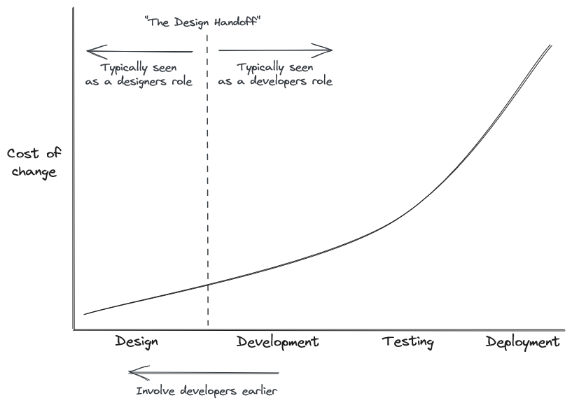

If I had a dollar for every time I heard the phrase _"I'm no good at design, so that's why I became a developer"_, I would be rich. In my experience, this phrase is often used as an excuse by developers to view design as a separate, siloed function that is someone else's job, much in the same way we used to treat operations prior to DevOps.

While I've always had a passing interest in web design, it wasn't until I gained experience working closely with designers that my appreciation for what they bring to a project grew. Unfortunately, there is no catchy way to push the words "design" and "developer" together, but from my experience, being able to foster greater collaboration and cross-role education massively benefits the user experience you are providing while also reducing your cycle times and rework.

In this article, I'm going to dive into my experience with how developers can impact the design process for the better and how they can better educate themselves about the fundamentals of design. I will mostly be focusing on UI design, as this is where the majority of my experience lies. However, it's also worth mentioning design thinking and human-centered design as areas that I feel need more exploration in terms of how developers can get involved to improve outcomes for your end-users.

## Applying DevOps Learnings to Design

Just as [shift left](https://www.dynatrace.com/news/blog/what-is-shift-left-and-what-is-shift-right/) can be applied in DevOps to ensure that we are building the right thing the right way, we can apply a similar set of principles by involving developers in the design process. By doing so, developers can quickly answer questions about whether a feature is technically feasible, and it allows them to better understand the intended functionality.

Since we're cultivating a stronger relationship between developers and designers, it also makes sense for designers to be involved in the development process. Some things that I've seen work include deploying features to a shared environment for feedback while they are being developed and using [Storybook](https://storybook.js.org/) as a way to isolate components and understand their intent and functionality.

I could see this being taken further by including designers in the review process using [Vercel Preview Deployments](https://vercel.com/docs/concepts/deployments/preview-deployments) to allow them to comment on features before they have been deployed to production.

## Educating Developers in UI Design

I really started seeing the benefits of the designer-developer collaboration when I took more ownership of educating myself in design. I firmly believe that developers should know their way around Figma and be able to create even the simplest designs. Your first designs will be terrible, but if there's anything I've learned from adopting continuous deployment processes, it's that "if it hurts, do it more often, and bring the pain forward."

Once I realized that UI design comes down to a few fundamentals, I was able to accelerate my learning, gain more experience creating designs, and contribute more to the design process. These fundamentals are:

- **White Space** - the empty areas in a user interface, allows components to be separated and hold space.
- **Contrast** - helps separate elements from each other using color, brightness, and opacity.
- **Scale** - the size of elements which aids in readability and reinforces visual hierarchy.
- **Alignment** - gives structure and flow to a layout.
- **Color** - the skin of your UI.
- **Typography** - how the text looks and is structured.
- **Visual Hierarchy** - how the eye is guided throughout your layout which is influenced by each of the other fundamentals.

I also made a noticeable leap in understanding design when I started using [Tailwind CSS](https://tailwindcss.com/) in my projects. Tailwind is a CSS utility framework that makes it easy to craft beautiful user interfaces which features a number of sensible defaults that aid in the adoption of the aforementioned design fundamentals. The creators of Tailwind also wrote a book called [Refactoring UI](https://www.refactoringui.com/) which details how to create delightful experiences from a developers point of view.

But by far, the biggest influence on my design skills has been Gary Simon, the creator of [DesignCourse.com](https://designcourse.com/). In his course on UI/UX, he talks about design fundamentals and how to apply them in a number of ways. If you want to get a feel for the type of content he teaches, he has a really interesting [crash course on YouTube](https://www.youtube.com/watch?v=QwSN4n2sjR8).

I'd love to hear other people's experiences with design/developer collaboration and learning design as a developer. I feel like it's something that needs greater exploration because it can only result in increased efficiency and better outcomes for users.
