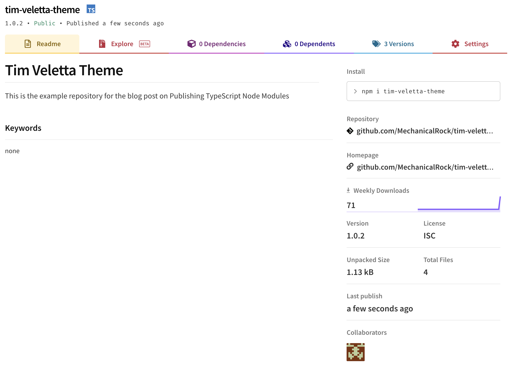
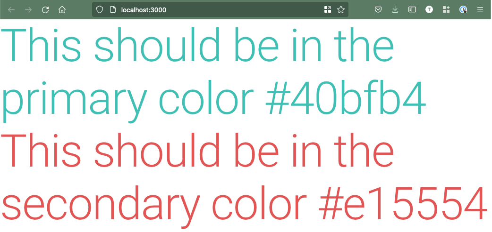

> This post was originally published on the [Mechanical Rock Blog](https://mechanicalrock.github.io/2022/01/24/publishing-typescript-npm-modules.html)

We're huge fans of TypeScript here at Mechanical Rock; the typing system and compilation allows us to catch possible errors at compile time, it allows us to refactor with confidence and the editor integration greatly enhances developer productivity. Occasionally, we run into situations where we might want to build a common set of components that can be shared across several applications or even having multiple teams working on separate parts of an application in isolation from one another.

In cases like these, it helps to build your own TypeScript modules that can be installed and managed through NPM. In this article I'm going to guide you through the creation of a new TypeScript module that allows you to share a Material UI theme across multiple applications by publishing it to the NPM package registry.

## Getting Started

Firstly, lets initialise a new project by creating an empty directory and running `npm init -y` (the `-y` automatically accepts all options) which produces a `package.json` file that looks like this:

```json
{
  "name": "tim-veletta-theme",
  "version": "1.0.0",
  "description": "",
  "main": "index.js",
  "scripts": {
    "test": "echo \"Error: no test specified\" && exit 1"
  },
  "keywords": [],
  "author": "",
  "license": "ISC"
}
```

Next install TypeScript and the Material UI library as development dependencies with the command:

```sh
npm install typescript @mui/material --save-dev
```

Once we have TypeScript installed, run `npx tsc init` which will create a default `tsconfig.json` file which is used to help configure TypeScript. The reason we use `npx` to run the TypeScript compiler (`tsc`) is because it will look for the command in the locally installed dependencies rather than trying to use a globally installed version which would potentially cause version mismatch issues.

> If you ever need to find out what each of the configuration options means you can use this [handy guide](https://www.typescriptlang.org/tsconfig).

## Adding the Theme

Now, we are going to build our custom theme. Start by creating a `src` directory in the root of your project and within that we are going to create a new file called `index.ts`. In this file we'll initialise the Material UI theme and set the primary and secondary colours which will be shared among projects using this theme.

> You can find out more about the [Material UI theming options here](https://mui.com/customization/theming/)

```js
import { createTheme } from "@mui/material/styles";

const theme = createTheme({
  palette: {
    primary: {
      main: "#40bfb4",
    },
    secondary: {
      main: "#e15554",
    },
  },
});

export default theme;
```

That's it! That's all this project needs in the way of code, but how do we build it and where should we put the output?

Well within our `tsconfig.json`, we can add the following lines to the `compilerOptions`.

```json
"compilerOptions": {
    "outDir": "./dist",
    "declaration": true
}
```

The `outDir` parameter tells TypeScript where to put the compiled TS files while setting `declaration` to `true` ensures the type definition files are generated.

Next, we should add a new script to the `package.json` that will define how we build our project. At this stage, you might also want to add a script called `prepublishOnly` that tells NPM to build the project prior to publishing it to the NPM registry.

```json
"scripts": {
    "build": "tsc",
    "prepublishOnly": "npm run build"
}
```

Let's try running it with:

```sh
npm run build
```

Once that command completes successfully, you should notice some files have been added to your project in the `dist` file. If you look through those files, you may notice that it includes references to `@mui/material/styles` since we used that library within the theme code we wrote above. But how do we ensure that projects using our module have `@mui/material` installed?

Well, that's where peer dependencies come in!

Peer dependencies are a way of defining what packages our module requires and the particular versions it is compatible with. When installing our module, NPM checks if the peer dependencies exist already within the project and if they are, that they are of the correct version. If the peer dependencies do not already exist within the project, it installs those dependencies. So let us add some `peerDependencies` to our `package.json`.

> In earlier versions of NPM, peer dependencies were not automatically installed and would raise a warning telling the user to install them. As of NPM v7, peer dependencies are installed by default. You can check which version of NPM you are using with `npm -v`.

```json
"peerDependencies": {
    "@mui/material": "^5.0.0",
    "@emotion/styled": "^11.3.0"
}
```

You might not have expected that `@emotion/styled` would show up in this list; we have to include it since its usually an optional dependency of `@mui/material` but it is required for generating Material UI themes.

## Publishing to a Registry

We are almost ready to publish our module, we just need to tell NPM where our compiled code is sitting which can be done by adding the following block to your `package.json`:

```json
{
  "main": "dist/index.js",
  "types": "dist/index.d.ts",
  "files": ["/dist"]
}
```

And finally, we can run `npm publish`.

But wait! What's this error?!

```sh
npm ERR! code ENEEDAUTH
npm ERR! need auth This command requires you to be logged in.
npm ERR! need auth You need to authorize this machine using `npm adduser`
```

You need an account on NPM (with a verified email address) to be able to publish your package which you can [sign up for here](https://www.npmjs.com/signup). We can then run `npm adduser` with the user credentials we just created to sign in to the NPM registry from the command line.

Let's try running `npm publish` again.

And we should get the output...

```sh
npm notice
npm notice 📦  tim-veletta-theme@1.0.0
npm notice === Tarball Contents ===
npm notice 81B  dist/index.d.ts
npm notice 340B dist/index.js
npm notice 489B package.json
npm notice === Tarball Details ===
npm notice name:          tim-veletta-theme
npm notice version:       1.0.0
npm notice filename:      tim-veletta-theme-1.0.0.tgz
npm notice package size:  616 B
npm notice unpacked size: 910 B
npm notice shasum:        8d6517abb56fab745484a03e99b8351eb9137c19
npm notice integrity:     sha512-gWgTDeJqBEfkd[...]IJ0aRjxpWnPDg==
npm notice total files:   3
npm notice
+ tim-veletta-theme@1.0.0
```

There it is! The module has been added to the NPM registry and anyone using the registry can install it into their project. You can view the module on the [NPM registry](https://www.npmjs.com/package/tim-veletta-theme) or the [Github repository](https://github.com/MechanicalRock/tim-veletta-theme).



## Using the Package

Let's test out the module in a new React project by installing it with:

```sh
npm install tim-veletta-theme
```

This should also install the `@mui/material` and `@emotion/styled` packages for us as they were listed as `peerDependencies` of our module. From here, we can inject our Material UI theme and see it in action!

> You can view the [test repository here](https://github.com/MechanicalRock/module-test)

```jsx
// /src/App.js
import { ThemeProvider, Typography } from "@mui/material";
import theme from "tim-veletta-theme";

function App() {
  return (
    <ThemeProvider theme={theme}>
      <Typography variant="h1" color="primary">
        This should be in the primary color #40bfb4
      </Typography>
      <Typography variant="h1" color="secondary">
        This should be in the secondary color #e15554
      </Typography>
    </ThemeProvider>
  );
}

export default App;
```

When we run it in the browser, we should see the text in the primary and secondary colours we set in our module.



So there we have it, you can now build your own NPM modules using TypeScript and make them publicly available on the NPM registry. Often when working with clients we don't want to make modules publicly available so I'll be doing a follow up post on hosting NPM modules privately via either the NPM registry or a private artifact repository so stay tuned for that.

Can we accelerate your delivery speed by building common components or themes that can be used across multiple applications? [Get in touch with us to find out how.](https://www.mechanicalrock.io/lets-get-started/)
