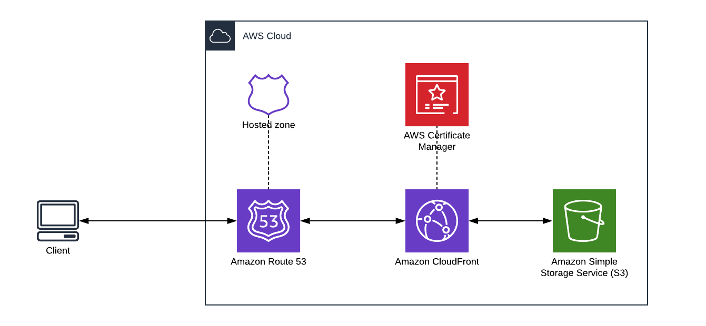

For the past couple of years, I’ve been all in on AWS, I work with it every day and choose to use it for a number of my own projects on the side but lately, I have started to change. One of the main reasons for this is the time investment involved in keeping up to date with AWS services and learning new ones that help me achieve what I want. Also the documentation for each of these services can be a bit hit-or-miss and in a large number of cases there is a SaaS product out there that does a better job, in a better way.

In this article I’m going to give a couple of examples of SaaS products I’d rather use than the comparable AWS service as an example of the types of products I would use to get a new side project off the ground and into production. A large number of my projects involve a few common elements including:

- Hosted front-end built with NextJS
- Serverless compute
- Data store
- Authentication
- CI/CD

So I feel like it would be important to cover these elements below along with a few others that help make my job a bit easier and more enjoyable.

## Hosted Front-End

Here the choice is easy; **Vercel** makes it so easy to connect a Github repository, deploy an application and manage the hosting. It also helps that NextJS is developed by Vercel but that doesn’t mean you cant easily deploy your Svelte, Vue or Astro sites there.

If you were to try and tackle this in AWS you would have to configure Route53 to point to a Cloudfront distribution which would then point to an S3 bucket but even then you would only be able to manage static or client-rendered sites. I've shown an example of how to do this in my post on [Scaffolding your AWS single page application infrastructure with CDK](/blog/scaffolding-your-aws-single-page-application-infrastructure-with-cdk)

The general direction for React and other web frameworks is that they are moving more towards a server-rendered model where the server fetches the necessary data to render the page before sending it to the client. Doing it this way allows for faster initial loading of sites, a better user-experience and improved SEO ranking.

## Serverless Compute

Again, the logical choice for this is **Vercel** for many of the aforementioned reasons. Vercel Serverless Functions work much the same as AWS Lambda functions including automated scaling, multiple runtimes and the ability to be run at the edge.

NextJS makes it easy to write Serverless Functions since its something that is baked into your project from the start with the `/api` directory but you can still take advantage of them even if you’re not using NextJS.

Although I’m opting to use Vercel for my serverless compute, I’m still a huge fan of AWS Lambda; its more because I’m using Vercel for my hosting that it makes sense for me to also use Serverless Functions because then I don’t have to mess around with AWS permissions and managing everything through Cloudformation, CDK, Terraform etc.

## Data Store

Honestly, I’ve never really gone deep on databases and have only ever used the solution that made it easy for me to get up and running with the least amount of pain. In the past I’ve used Firebase, Mongo and AWS DynamoDB (I really like [Single Table Design](https://aws.amazon.com/blogs/compute/creating-a-single-table-design-with-amazon-dynamodb/)) because of their flexibility and ease of use but they’ve all had their pain points.

**PlanetScale** is the first database related service that I’m actually excited to use and learn more about. I really like their branching feature that allows you to manage your database like you would code including a Pull Request like flow to release changes to your database.

I’m also a huge fan of using **Prisma** as an Object-relational mapping (ORM) tool to manage my database schema and interactions from my serverless functions. The combination of Prisma and PlanetScale is super

## Authentication

You could go any number of directions for authentication including Auth0 and Okta as an alternative to AWS Cognito as many others have done but I’ve been using **Clerk** recently and have had nothing but good experiences.

Clerk makes it very easy to add user sign up and authentication flows to your application including a large number of [social connections](https://clerk.dev/docs/authentication/social-connections-oauth). Clerk also integrates well with NextJS including helpers for both your front-end and serverless functions.

## CI/CD

Finally, because I’m using Github to manage my code repositories, it makes sense to use **Github Actions** for CI/CD as opposed to AWS CodeBuild and CodePipeline. The big advantage Github Actions has is its integrations and community workflows which make it easy to leverage common, repeatable patterns that have been created by the community.

One such example of a community workflow is `aws-actions/configure-aws-credentials` which is used to configure your Github Actions to access AWS as seen in my article on [Pushing Content to AWS S3 from Github Actions](https://www.timveletta.com/blog/pushing-content-to-s3-from-github-actions).

## What about IaC?

Something that is notably missing from my recommendations above is an Infrastructure as Code (IaC) tool such as Terraform or AWS CloudFormation to manage your deployed resources in a scalable and repeatable way. Technically, my CI/CD is managed using IaC with Github Actions Workflows and my database schema is managed via Prisma but in the case of Vercel, Clerk and PlanetScale its click-ops all the way.

Again, this comes down to time, learning difficulty and relying on the service providers to provide the service they advertise which in most cases is using AWS under-the-hood anyways.

## What about the cost?

Each of the services I’ve listed above have generous free tiers, something that AWS only offers within your first 12 months. The free tiers are as follows:

- **Vercel** offers free use for personal or non-commercial projects with up to 100GB of bandwidth so its perfect for putting together a proof of concept. After that its **$20 per user / month** for up to 1TB of bandwidth.
- **PlanetScale** free tier allows for up to 5GB of database storage and 1 billion row reads per month. Its then **$29 per month for 10GB of storage** and **$599 for 100GB of storage**.
- **Clerk** allows up to 5,000 monthly active users (MAUs) on its free tier however it must include the Clerk branding. The remaining pricing structure confused me a bit; its **$25 per month** to remove the branding but allows for only 1,000 MAUs + $0.02 per additional user meaning to hit your original 5,000 MAUs it will cost **$105 per month**. Frustratingly, multi-factor authentication (MFA) is only available to you on the **$99 per month** plan so you’ll be paying **$179 per month** for your 5,000 MAUs.
- **Github Actions** offers 2,000 minutes and 500GB on its free tier and then $4 per user / month for up to 3,000 minutes and 1GB of storage.

Each of the free tiers are enough to get a proof-of-concept off the ground and test the market and if I ever get to the point where I’m worrying about exceeding 100GB of bandwidth on Vercel, 5GB of database storage on PlanetScale or even 1,000 MAUs on Clerk, I’m probably doing something right.

If there ever comes a time where using one of these services becomes cost-prohibitive, replacing them with the equivalent AWS services might be worth my time.

## Bonus Advice

While I’m plugging services and products that I recommend, I should finish with one project I’ve extremely excited to be using and that is [Create T3 App](https://create.t3.gg/). This community project is a great starting point for building a full-stack, typesafe application using NextJS, TRPC, Prisma and Tailwind.

The documentation around Create T3 App is amazing and by using the aforementioned SaaS products; you can get a full-stack application deployed in a short time so you can spend more time developing features that matter to your users.
