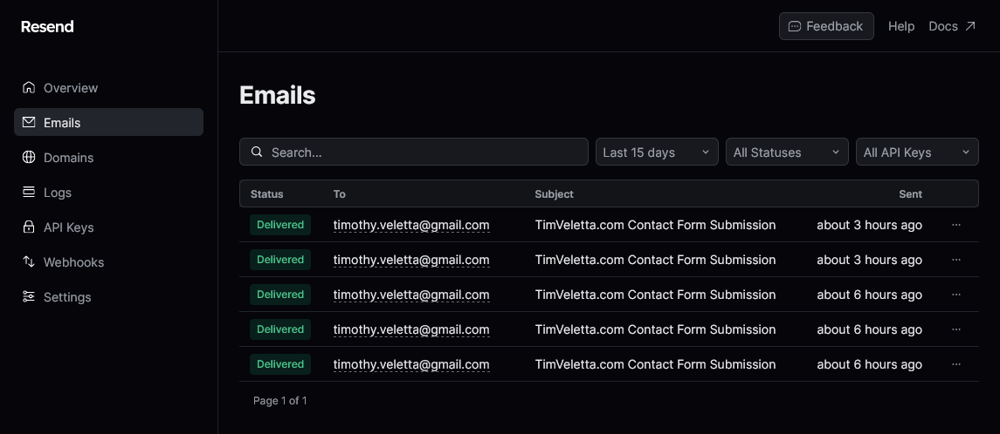

If you're looking for an easy way to send emails from your Node.js or Next.js applications, [Resend](https://resend.com) might be the answer. Resend is focused on the developer experience, making it easy for you to send emails. They are also the creators of [React Email](https://react.email/), an open-source library that simplifies creating formatted emails for sending.

To get started with Resend, sign up and verify the domain you want to send emails from. Domain verification is simple with Resend, thanks to their focus on reducing friction which you can [read about on their blog](https://resend.com/blog/new-domain-verification-experience). You can then add Resend to your project with:

```sh
npm install resend
```

After adding Resend, initialize it with:

```javascript
const resend = new Resend(process.env.RESEND_API_KEY);
```

The `RESEND_API_KEY` can be created on the "API Keys" page in Resend. You can now send emails with:

```javascript
const data = await resend.emails.send({
  from: "contact@timveletta.com", // must verify the from domain
  to: "timothy.veletta@gmail.com",
  subject: "Resend is easy!",
  html: "<p>You should try it</p>",
});
```

If you're using Vercel Functions, add your API Key to the Environment Variables on Vercel, deploy your app, and hit your API endpoint. You can also check the "Emails" page in Resend to see what emails it has sent.



I'm currently using Resend to notify me of people using the contact form on this website but I'm planning to use it and React Email on some other projects. You can view [my contact form function on Github](https://github.com/timveletta/timveletta-com/blob/main/api/contact.js).
