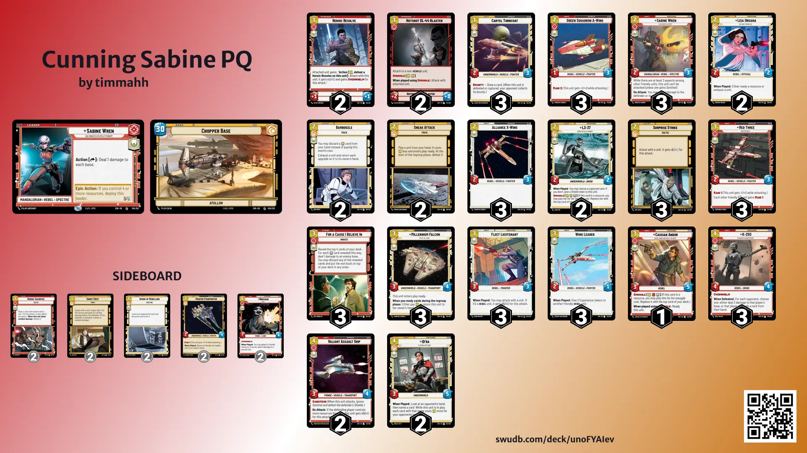

> TL;DR I went 2-2 but the scoreline isn’t as important.

It was bright and relatively early when I set off for Good Games Joondalup, knowing that I had an hour journey ahead of me on my bike and the train; it felt like a good opportunity to do a bit of reflection on why we play the game and the sense of community it brings.

For me, SWU and the community we have in Perth came in a period of transition in friendships as is expected throughout life as people grow and interests change; sometimes the things that used to give you energy no longer do.

I still remember showing up to my first store showdown with Krennic ECL, a list that I fell into because I got lucky and had a set of Vaders from my first 3 boxes of SWU, not really knowing anyone in the local community but wanting to try out a new trading card game. I went 1-3 that day however for me, the scoreline wasn’t important. Instead I was made to feel welcome amongst people that had known each other for seemingly ages.

I was told of this games shop near the place I was moving to called Beskar Forge, a reference lost on me having not seen the Mandalorian. It was a place where I knew from the moment I walked in, I had found my third place.
For those of you that haven’t come across the term third place, its is somewhere other than home and work that you go to connect with others with similar interests. In an age governed by mobile phones and social media, having a third place feels as important as ever. For many people, this may be a sporting club or any other type of club and for me, its Beskar Forge and the SWU community in Perth.

When I started playing this game, I had no idea it would take me to game stores all over Perth or that it would involve flying to Melbourne to compete in the first round of Planetary Qualifiers to be held for the game. In order to invest this level of my own personal time and money, I feel like its important think about and realise the reason I play the game.

While the aim of each game is to get your opponents base to 0 life and the mechanics promote a level of deep thinking around resourcing decisions, what my opponent could have or what the cause I believe in is; those are just supplementary to the community that has been built here and the sense of belonging it entails. Its the reason why going 2-2 at a Store Showdown, as mid as can be, is fun!

I think the reason I mention all this is that by being made to feel welcome and part of the community, I’ve got something far more than winning or losing a few games of cards. Its a sense of belonging and friendship in being able to get together weekly to play what is ultimately a very enjoyable game. The next time you see someone at your locals who looks like they might not know anyone, make them feel welcome and part of the group because I can guarantee that gesture means a whole lot to them.

This turned into a bit of a love letter to the SWU Perth community so thank you for bearing with me to this point. For those of you that actually want some actual tournament report content I've included some interesting moments from my games today below but honestly don’t remember a huge amount from individual games.

As per usual I was playing Sabine Cunning - a deck that may not necessarily be the strongest in the metagame but it is the deck I have the most fun on and part of the reason I play is to have fun. I also feel like it might be a bit unexpected for some people come the PQ.

Round 1 I was paired against Shawn who was playing Palpatine Blue which on paper seems like a good matchup for me but I still have the mental scars from playing against his Palpatine in Set 1. I won game 1 by doing Sabine things but game 2, the restore from Colonel Yularen, Salacious Crumb and Vigilance stabilised the game to the point where it didn’t matter that I played 2 For a Cause I Believe In, I had no units to finish it off. I managed to take game 3 in a closely fought match despite making a terrible sideboard decision to bring in Sneak Attack which I played on K2-SO only for Shawn to put a Top Target on it.

Round 2 I played against BeskarPaul on Han1 Green, a deck I went 0-4 against in the previous weekends showdown but I feel like I misplayed at a couple of key moments so I was looking forward to playing against it again. In game 1, I had to deal with some early restore with 2 Sundari Peacekeepers on the board but the real decision point in the game was when he dropped Home One. I had 3 space units on the board with 10 combined power; I could either hit the base to take him to 25 damage or trade 2 of my units in order to kill it. I decided to go base only for Paul to play a Bright Hope next turn in order to slow me down enough for him to take out game 1.

In game 2 I managed to go super wide so that he couldn’t answer all my threats and game 3 came down to a decision to bounce my Falcon back to hand on 6 resources in order to play a Wrecker to take out Han leader. He responded with a Han unit to ambush Wrecker leaving me with nothing on board and my chance at redemption gone.

In round 3 I was paired against Ash running Boba Green which is one I really struggled against in Set 1 but hadn’t played much against in this set. Both games feel like a blur because I was pommelled into the ground both times. I feel like his deck does a few similar things to mine just better and I really didn’t know what to sideboard for this one. It may have been useful to draw a Qi’ra at some point to prevent an Overwhelming Barrage but I don’t feel like it would have made that much of a difference.

Finally, round 4 I played against Rhys on his Han2 Blue deck, a deck enjoyed playing early on in Set 2 but I just could not make it work consistently enough into the Sabine, Qi’ra and Bossk enjoyers of the world. Game 1 I did Sabine things and in game 2 he did Han2 Blue things including dropping a Redemption to halt my push in space - just something about space sentinels that really grinds my gears. Game 3 felt like he was an action from turning it around with a well timed Redemption paired with the Luke Skywalker restore however FACIBI got me over the line

Ultimately a really fun tournament at a store I hadn’t been to before amongst some really great people! Although I didn’t make top 4, I got to watch Bluey with Tom, Luke’s son, so that was just as good.
